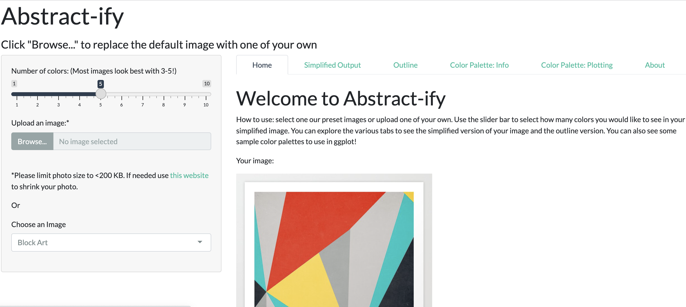

# Abstract-ify
## The Alphas: STA 313 Fall 2021

# Introduction 
We have created a shiny app which takes two user inputs: their own image and the 
number of colors they would like in their "abstract-ified" image. The app then 
gives the user a variety of outputs based on their image such as the abstract 
image, the image outline, a custom color palette which they can then download and 
use in their own ggplots, and finally they can see the color palette used in sample 
ggplots which utilize the bachelor degrees, dog adoption, and brexit data sets. 
Explore the app here: [bit.ly/abstractify](https://bit.ly/abstractify) 

# Repo Organization 
The data folder contains the sample images, the proposal folder contains our 
initial project idea, the scripts folder contains the outline function we created 
which finds the color boundaries in the user's image and creates an image outline, 
and the parse data file reads in some of the data used in our sample plots. Finally, 
the code for our app can be found under app.R. Static images such as the
screenshots of our writeup can be found in the www directory for ease of use with
HTML's img tag. 

